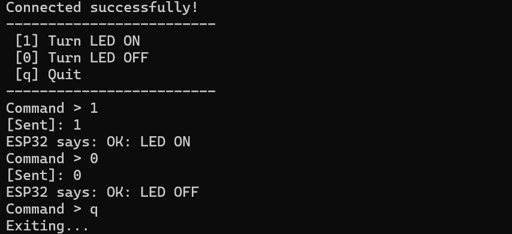
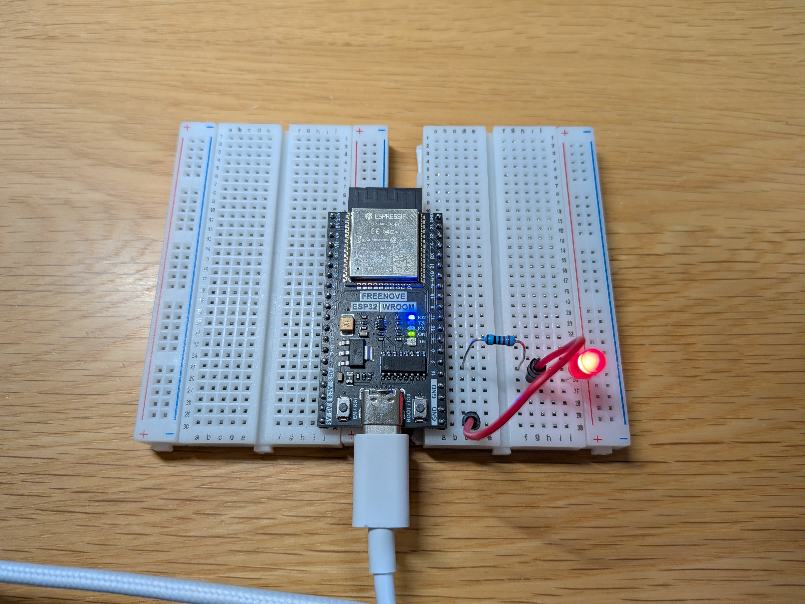
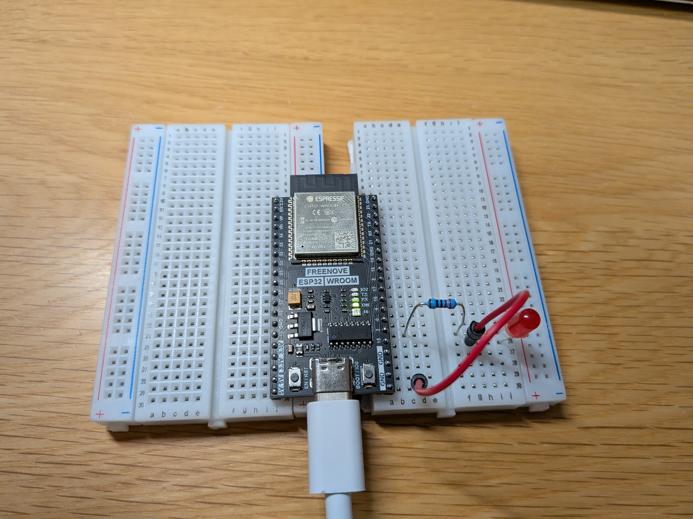

# Esp32-Tcp-Socket-Demo

## 1. Abstract (概要)
* **What:** ESP32（サーバー）とPC上のJavaアプリケーション（クライアント）間での、Wi-Fiを経由した双方向通信システム。
* **Why:** 将来的なネットワーク工学の研究に向け、ソケット通信と異言語間（C++とJava）のデータ連携を理解するため。
* **Result:** Javaクライアントからのコマンド送信により、ワイヤレスでLEDを制御することに成功した。また、設定ファイルを分離する設計により、移植性とセキュリティを考慮した実装を行った。

## 2. Motivation (背景と目的)
* **ネットワーク通信の基礎習得:** ソケット通信を実装することで、3ウェイ・ハンドシェイクやパケット送受信の仕組みを理解するため。
* **IoTシステムの試作:** 「PCから物理デバイスを操作する」というIoTの基本構成を構築するため。

## 3. Technical Specifications (技術仕様)

### Hardware
| Component | Model | Notes |
| --- | --- | --- |
| MCU | ESP32 Dev Module | Wi-Fi 2.4GHz, 3.3V |
| 5mm LED (Red) | RL5-R5015 | Super-Red (631nm) |
| Resistor | 100Ω | |
| Client Machine | Windows PC |  |

### Software
* **Server Side (Firmware):**
  * **Language:** C++ / Arduino Language
  * **Library:** `<WiFi.h>`
* **Client Side (Application):**
  * **Language:** Java (JDK 17)
  * **Class:** `java.net.Socket`, `java.util.Properties`
* **Network Protocol:**
  * TCP/IP (Transmission Control Protocol / Internet Protocol)
  * Port: 80

## 4. Design & Theory (設計と原理)
### 4.1 System Architecture (システム構成)
本システムは典型的な**クライアント・サーバモデル**を使用している。

1. **Server (ESP32):** 指定されたポート（Port 80）を開放し、接続待ち状態となる。
2. **Client (Java):** サーバーのIPアドレスとポートを指定して接続要求を送る。
3. **Communication:** 接続確認後、ストリームを通じてバイトデータを送受信する。

### 4.2 Circuit Design (回路設計)
ESP32のGPIOピンは **3.3V** 出力であるため、順電圧 $V_f = 2.0V$、目標電流 $I_f = 20mA$と仮定する。

$$R = \frac{V_{cc} - V_f}{I_f} = \frac{3.3 - 2.0}{0.02} = 65 [\Omega]$$

上記の式より、今回は **100Ω** の抵抗を使用した。

### 4.3 Algorithm & Implementation (実装の工夫)

**1. バッファリング対策 (Data Flushing)**

Javaの `PrintWriter` は送信データをバッファリング（一時保存）する特性があるため、単に `print()` するだけでは即座にパケットが送信されない問題が発生した。これに対し、`writer.flush()` で、データを強制的にネットワークへ送出し、リアルタイムな操作性を実現した。

**2. 設定の外部化 (Externalizing Configuration)**

ハードコーディング（IPアドレスの直書き）を避けるため、Javaの `Properties` クラスを使用した。接続先情報（IPアドレス、ポート番号）を外部ファイル `config.properties` に分けることで、再コンパイルなしで接続先を変更可能とした。また、ソースコードをGitHubで公開する際のセキュリティリスク低減にも寄与している。

## 5. Experimental Results (実験結果と考察)

### Results (結果)
* **接続確立:** Javaプログラム起動後、瞬時にESP32とのTCP接続が確立され、ESP32側のシリアルモニタに `New Client connected.` が表示されることを確認した。
* **制御応答:**
  * コマンド `1` 送信 → 即座にLEDが点灯。
  * コマンド `0` 送信 → 即座に消灯。
  * コマンド `q` 送信 → ソケットを切断し、正常に終了。

### Discussion (考察)
**1. TCP通信の「確実さ」**

本システムはTCPを使用したことで、データが途中で消えることなく確実に届くことを確認できた。
「LEDを点ける」といったハードウェア制御では、命令が届かないと誤作動に繋がるため、ハンドシェイクを行わないUDPと比べて、手順を踏んで接続するTCPの方が向いていると理解できた。

**2. `flush()` の重要性（トラブルシューティング）**

実験中、コードは合っているはずなのにデータが送信されない問題が発生した。原因は、Javaの仕組みとしてデータがある程度溜まるまで送信を待つ（バッファリング）ことだった。これに対し、`writer.flush()` を使ってデータをためないようにすることで解決した。

**3. 言語を超えた通信**

PC側はJava、マイコン側はC++（Arduino言語）という異なるプログラミング言語同士でも、TCP/IPという共通のルール（プロトコル）を守れば問題なく通信できることを実証できた。

## 6. Usage (使い方)

`client/JavaClient/` フォルダ内の`README.txt`を参考にしてください。

## 7. References (参考文献)
使用した各部品のデータシートは`docs`フォルダ内のPDFを参照してください。
* ESP32 WiFiライブラリの活用｜±壱《プログラム×デジタルコラム》(https://note.com/yagi7721/n/nc0e2d8f2770f)

* WIFI環境でESP32を使ったサーバーを立ててみよう！ #Arduino (https://qiita.com/northVil/items/f5cfee1cfd38ece59bb5)

* マイコン使って「IoT機器でも作ってみない？」2日目 #C++ - Qiita (https://qiita.com/nattyan_tv/items/6c80de46ecc0626177eb)
